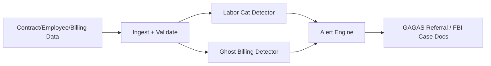

<!-- Unlicense — cochranblock.org -->

# Proof of Artifacts

*Visual and structural evidence that this project works, ships, and is real.*

> Proactive detection of Labor Category Fraud and Ghost Billing for DoD IG and FBI fraud investigators.

## Architecture



## Build Output

| Metric | Value |
|--------|-------|
| Language | Rust |
| External dependencies | Zero runtime services |
| Detection rules | 5 (LABOR_VARIANCE, LABOR_QUAL_BELOW, GHOST_NO_EMPLOYEE, GHOST_NOT_VERIFIED, GHOST_BILLED_NOT_PERFORMED) |
| Legal basis | DoDI 5505.02/03, DoD OIG Fraud Scenarios, AG Guidelines |
| Test suite | f49–f60 (embedded) |
| Cloud dependencies | Zero |

## How to Verify

```bash
cargo build --release
cargo run --release -- --data-path fixtures run
cargo run --release -- --test
```

## Documentation

- [USER_STORY_ANALYSIS](docs/USER_STORY_ANALYSIS.md) — DoD IG / FBI personas
- [TRIPLE_SIMS_WHYYOULYING](docs/TRIPLE_SIMS_WHYYOULYING.md) — Sim 1–4
- [TRIPLE_SIMS_ARCH](docs/TRIPLE_SIMS_ARCH.md) — Domain model, pipeline

---

*Part of the [CochranBlock](https://cochranblock.org) zero-cloud architecture. All source under the Unlicense.*
