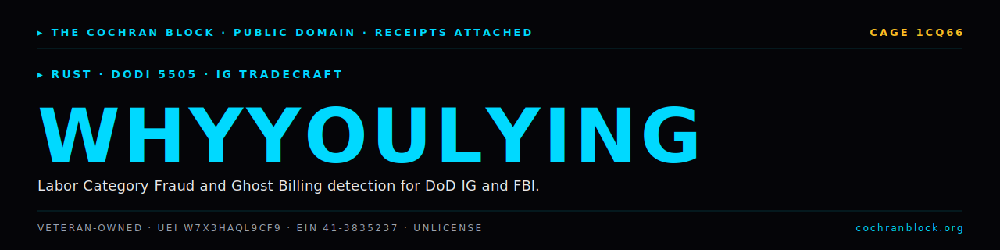
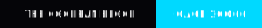

<!-- COCHRANBLOCK-BRAND-HEADER:START - generated by cochranblock/scripts/brand-stamp.sh -->
<picture>
  <source media="(prefers-color-scheme: dark)" srcset="assets/brand/banner.svg">
  <source media="(prefers-color-scheme: light)" srcset="assets/brand/banner.svg">
  
</picture>

[](https://unlicense.org)
[](https://www.rust-lang.org)
[](https://cochranblock.org)
[](https://cochranblock.org)

> &#9656; **RUST** &#183; **DODI 5505** &#183; **IG TRADECRAFT**
<!-- COCHRANBLOCK-BRAND-HEADER:END -->


# whyyoulying

**Proactive detection of Labor Category Fraud and Ghost Billing for DoD IG and FBI fraud investigators.**

Per DoDI 5505.02/03, DoD OIG Fraud Scenarios, and Attorney General Guidelines.

---

## Documentation

This README is the entry point. The actual docs live in two source-of-truth files at the root of the repo:

- **[PROOF_OF_ARTIFACTS.md](PROOF_OF_ARTIFACTS.md)** — what exists today, status, source-linked. Quick start, CLI commands, data format, detection rules. If you want to know what this project *does*, read this.
- **[TIMELINE_OF_INVENTION.md](TIMELINE_OF_INVENTION.md)** — dated, commit-level record of what was built, when, and why. If you want to know how this project *got built*, read this.

Supporting docs:
- [docs/USER_STORY_ANALYSIS.md](docs/USER_STORY_ANALYSIS.md) — DoD IG / FBI personas
- [docs/TRIPLE_SIMS_WHYYOULYING.md](docs/TRIPLE_SIMS_WHYYOULYING.md) — Sim 1–4
- [docs/TRIPLE_SIMS_ARCH.md](docs/TRIPLE_SIMS_ARCH.md) — Domain model, pipeline

---

## Run It

```bash
cargo build --release
cargo run --release -- --data-path fixtures run
cargo run --release -- --test
```

Full details in [PROOF_OF_ARTIFACTS.md](PROOF_OF_ARTIFACTS.md).

---

## License

Unlicense (public domain). See [LICENSE](LICENSE).

Part of the [CochranBlock](https://cochranblock.org) zero-cloud architecture.
<!-- COCHRANBLOCK-BRAND-FOOTER:START - generated by cochranblock/scripts/brand-stamp.sh -->

---

<sub>&#9656; **THE COCHRAN BLOCK, LLC** &#183; Veteran-Owned &#183; **CAGE** `1CQ66` &#183; **UEI** `W7X3HAQL9CF9` &#183; **EIN** `41-3835237`</sub>

<sub>&#9656; PUBLIC DOMAIN &#183; UNLICENSE &#183; RECEIPTS ATTACHED &#183; [**cochranblock.org**](https://cochranblock.org) &#183; [github.com/cochranblock](https://github.com/cochranblock)</sub>
<!-- COCHRANBLOCK-BRAND-FOOTER:END -->
